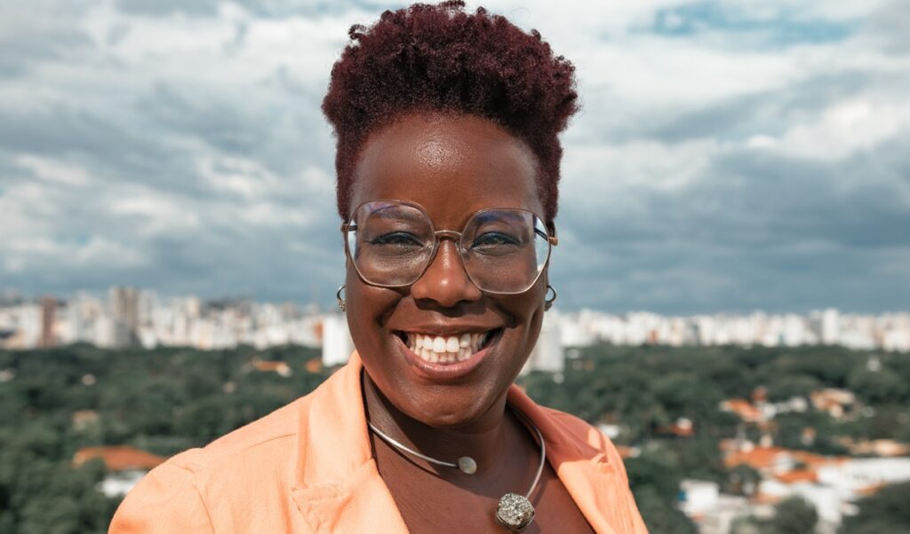

# Maitê Lourenço

Profissional multidisciplinar que viu na tecnologia uma oportunidade para dar voz a pessoas negras.

## Biografia

- Formada em psicologia, atuava em gestão de carreiras.
- 2010 - Abriu uma empresa para auxiliar as pessoas em processos seletivos (currículos, entrevistas).
- Decidiu integrar IA nas operações da empresa e por isso passou a participar de eventos voltados para startups da área de tecnologia.
- Percebeu que toda a atenção e investimento desses eventos eram direcionados de homens brancos para outros homens brancos, sem espaço para mulheres negras como ela.
- 2016 - Fundou a BlackRocks, aceleradora de startups de tecnologia lideradas por pessoas negras.
- 2021 - Listada entre os 100 maiores empreendedores latino-americanos (Bloomberg Línea).
- 2022 - Em seis anos de atuação, a BlackRocks já havia acelerado mais de 30 startups. Nesse ano, também foi palestrante na Brazil Conference (Harvard/MIT).
- 2025 - Nomeada na categoria Mercado de Capitais pelo MIPAD (Most Influential People of African Descent).

## Soft Skills

...

## Impacto Social e Representatividade

...